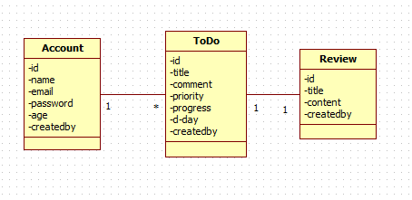

# Spring Restful API (To-Do List)

> To-Do List용 Restful API 서버

## Environment

- JDK 11.0.1
- Spring boot 2.1.1.RELEASE
- IntelliJ Ultimate Version
- Spring JPA / Postgresql 10.6 (prod) / H2 (test)
- Spring HATEOAS
- Spring Rest Docs
- Spring Security
- Gradle
- Heroku (deploy server)

## 요구사항

1. 사용자 관리
    - 로그인 / 로그아웃 / 회원가입 필요
    - 사용자 정보를 자체 관리
    - 가능하면 OAuth2를 사용하여 구글, 페이스북, 네이버, 카카오로 로그인 적용
2. 할 일
    - 날짜 별로 관리
    - 중요도 설정할 수 있도록 적용
    - 진행 상황 관리 가능 (진행률)
    - 등록시 해당 할일에 코멘트 작성 가능
3. 리뷰
    - 할 일 1개당 하나의 리뷰를 작성할 수 있다.
    - 할 일의 기간이 끝난 후 했던 일에 대해 반성 / 개선을 위한 기능

## DB 설계

 

## url 설계

1. {baseurl}/docs/index.html

self-descritive를 만족하기 위한 api의 명세가 있는 문서의 url

2. {baseurl}/auth/*

사용자 인증을 위한 url

3. {baseurl}/api/todo

할 일 정보를 가져올 수 있는 url

4. {baseurl}/api/todo/{id}/review

할 일에 대한 리뷰 정보를 가져오는 url
